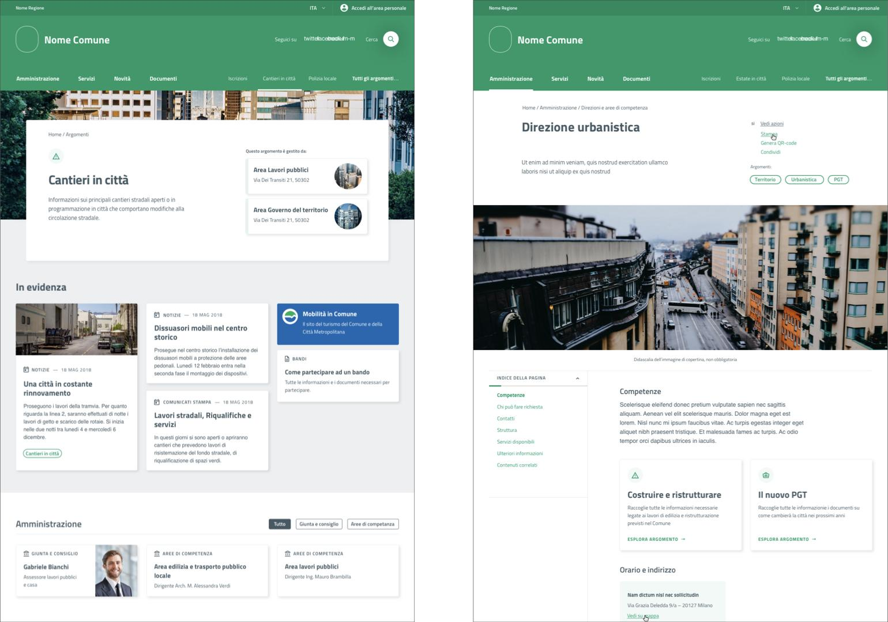
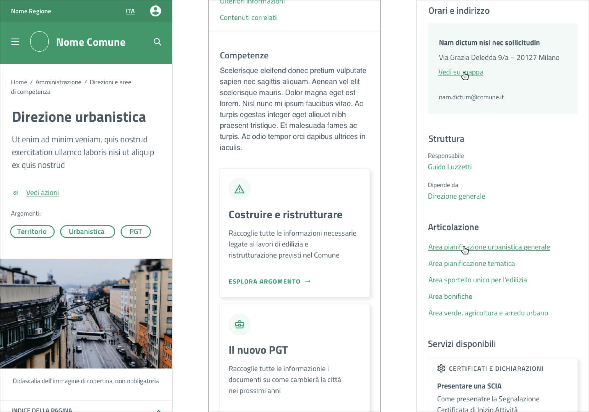
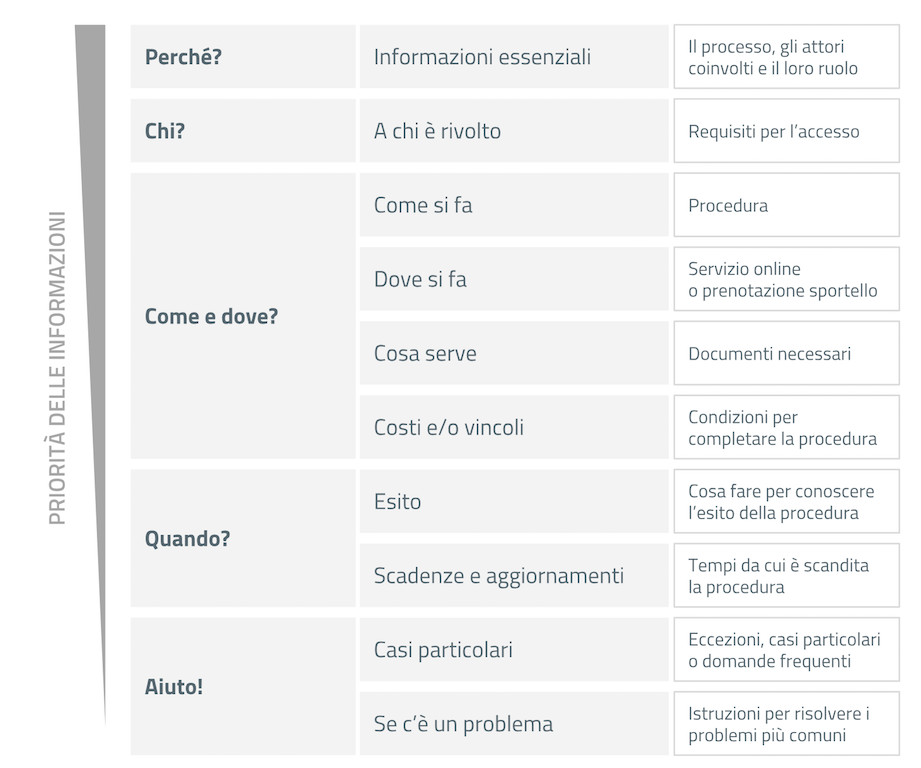
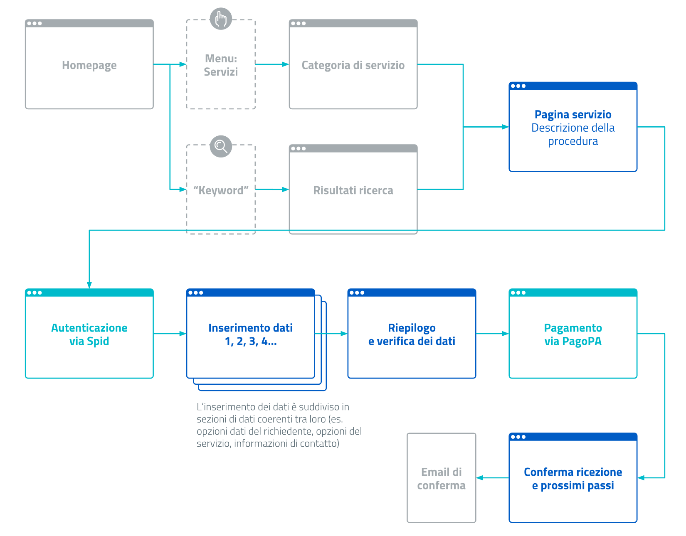
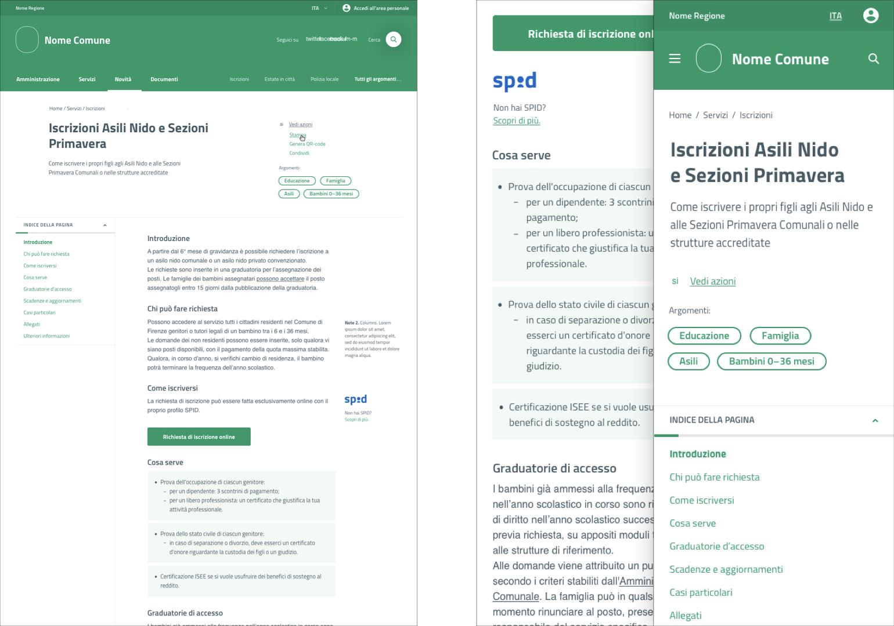

Architettura dell’informazione 
===============================

I contenuti del sito sono organizzati e resi accessibili a partire da
due attributi fondamentali:

-  **Tipo di contenuto** (*content type*), ovvero le caratteristiche
   strutturali delle informazioni. Permette di trovare le informazioni
   seguendo una tassonomia.

-  **Argomenti** (*tag*), ovvero gli argomenti rilevanti con le
   informazioni contenute in una pagina. Permettono di raggiungere le
   informazioni per analogia.

Il modello di architettura dell’informazione che nasce da questo progetto è
presentato nella :numref:`Tabella %s <tabella-ai>`. 
I contenuti sono organizzati in quattro sezioni (Amministrazione, Novità,
Servizi e Documenti) più la sezione Amministrazione trasparente.  Esiste poi
un’area personale, accessibile tramite login.  Ciascuna area ha una propria
tassonomia specifica (divisione in categorie), mentre una lista di argomenti permette di
aggregare tutte le tipologie di contenuti in aree omogenee, funzionali ai
bisogni dell’utente. Abbiamo pensato che sia possibile associare queste pagine
argomento a uno o più uffici del comune, per rispondere ai bisogni dei
cittadini e mostrare ai cittadini quali sono gli enti che se ne occupano.

   Gli argomenti raccolgono i contenuti e i servizi che
   afferiscono ad uno o più uffici, facilitando dove necessario l’accesso
   ai siti tematici (sinistra). Ogni ufficio è raccontato tramite una
   scheda che ne evidenzia i servizi e i contenuti (destra).

Un’alternativa ai siti tematici
-------------------------------

La struttura flessibile basata sugli argomenti permette di superare la
necessità di sviluppare e mantenere la maggior parte dei siti tematici
che spesso proliferano a fianco del sito istituzionale.

I contenuti già presenti nell’architettura del sito, infatti, possono
essere raccolti con un argomento. Tra gli esempi più diffusi ci sono il
consiglio comunale, con la sua struttura e le novità che lo riguardano,
oppure le iniziative e i servizi legati alla raccolta differenziata.

La pagina può essere ulteriormente personalizzata anche nell’aspetto
grafico con un’immagine di sfondo, un eventuale marchio e, se
necessario, una serie di pagine in evidenza.

Un altro caso d’uso per un sito tematico è quello di dare voce agli
uffici che compongono l’amministrazione. Gli argomenti offrono agli
uffici la possibilità di gestire i propri contenuti e condividere le
proprie iniziative.

   La pagina dedicata a ogni ufficio mostra non solo i contatti
   e le competenze generali, ma anche gli argomenti gestiti e i servizi
   offerti (wireframe).

.. table:: Architettura dell’informazione del sito dei comuni
   :name: tabella-ai

   +-----------------+-------------------------+--------------------------------+-----------------------------------------------------------------------------------------------------------------------------+------------------------------+
   | Sezioni         | Descrizione             | Categorie                      | Argomenti                                                                                                                   | Amminstrazione trasparente   |
   +=================+=========================+================================+=============================================================================================================================+==============================+
   | Servizi         | Procedure per scambiare | - Pagamenti                    | - Agevolazioni per la casa                                                                                                  | Tutti i contenuti del        |
   |                 | informazioni con il     |                                |                                                                                                                             | sito quando vengono          |
   |                 | comune e usufruire dei  | - Sostegno                     | - Animali                                                                                                                   | pubblicati possono essere    |
   |                 | servizi offerti         |                                |                                                                                                                             | classificati secondo la      |
   |                 |                         | - Segnalazioni                 | - Anziani                                                                                                                   | tassonomia prevista per      |
   |                 |                         |                                |                                                                                                                             | amministrazione trasparente, |
   |                 |                         | - Autorizzazioni e concessioni | - Assistenza e inclusione                                                                                                   | in modo da poter essere      |
   |                 |                         |                                |                                                                                                                             | visibili **anche** nella     |
   |                 |                         | - Certificati e dichiarazioni  | - Associazioni                                                                                                              | sezione amministrazione      |
   |                 |                         |                                |                                                                                                                             | trasparente                  |
   |                 |                         | - Servizi pubblici             | - Bambini e ragazzi                                                                                                         |                              |
   |                 |                         |                                |                                                                                                                             |                              |
   |                 |                         |                                | - Cantieri e progetti                                                                                                       |                              |
   |                 |                         |                                |                                                                                                                             |                              |
   |                 |                         |                                | - Comune                                                                                                                    |                              |
   |                 |                         |                                |                                                                                                                             |                              |
   |                 |                         |                                | - Comunicare con il comune                                                                                                  |                              |
   |                 |                         |                                |                                                                                                                             |                              |
   |                 |                         |                                | - Corsi e tempo libero                                                                                                      |                              |
   |                 |                         |                                |                                                                                                                             |                              |
   |                 |                         |                                | - Costruire e                                                                                                               |                              |
   |                 |                         |                                |   ristrutturare                                                                                                             |                              |
   |                 |                         |                                |                                                                                                                             |                              |
   |                 |                         |                                | - Cultura                                                                                                                   |                              |
   |                 |                         |                                |                                                                                                                             |                              |
   |                 |                         |                                | - ...                                                                                                                       |                              |
   |                 |                         |                                |                                                                                                                             |                              |
   |                 |                         |                                | `Lista completa <https://docs.google.com/spreadsheets/d/1tB7-hsyxmD6SF_4bj3C85tiZwwDfWEGrrr-DyYgXg9o/edit#gid=1007028751>`_ |                              |
   |                 |                         |                                |                                                                                                                             |                              |
   |                 |                         |                                |                                                                                                                             |                              |
   +-----------------+-------------------------+--------------------------------+                                                                                                                             |                              |
   | Documenti       | La versione digitale    | - Progetti e attività          |                                                                                                                             |                              |
   |                 | di un atto ufficiale o  | - Atti amministrativi          |                                                                                                                             |                              |
   |                 | di un progetto          | - Bandi                        |                                                                                                                             |                              |
   |                 | dell'amministrazione    | - Concorsi                     |                                                                                                                             |                              |
   |                 |                         | - Albo pretorio                |                                                                                                                             |                              |
   +-----------------+-------------------------+--------------------------------+                                                                                                                             |                              |
   | Amministrazione | La struttura            | - Giunta e consiglio           |                                                                                                                             |                              |
   |                 | dell'amministrazione    | - Aree di competenza           |                                                                                                                             |                              |
   |                 | e le modalità di        | - Cariche                      |                                                                                                                             |                              |
   |                 | accesso alle risorse    | - Dipendenti                   |                                                                                                                             |                              |
   |                 |                         | - Luoghi                       |                                                                                                                             |                              |
   |                 |                         | - Associazioni e               |                                                                                                                             |                              |
   |                 |                         |   società partecipate          |                                                                                                                             |                              |
   +-----------------+-------------------------+--------------------------------+                                                                                                                             |                              |
   | Novità          | Contenuti effimeri,     | - Notizie                      |                                                                                                                             |                              |
   |                 | validi per un periodo   | - Eventi                       |                                                                                                                             |                              |
   |                 | di tempo circoscritto   | - Comunicati stampa            |                                                                                                                             |                              |
   +-----------------+-------------------------+--------------------------------+-----------------------------------------------------------------------------------------------------------------------------+------------------------------+

`Maggiori dettagli sull'architettura delle
informazioni <https://docs.google.com/spreadsheets/d/1A7AzDZ1CI-M2e8lMHjd29xXRCTUgCTYzBhl1LwTvDEE/edit?usp=sharing>`__.

L’area personale
----------------

La comunicazione con i cittadini che usufruiscono di un servizio è
gestita dall’area personale. Oltre a un accesso organizzato ai
procedimenti, che segue l’architettura familiare dell’area pubblica, i
servizi che richiedono maggiore attenzione sono portati in primo piano
in un centro messaggi unificato.

L’obiettivo è di rendere immediato l’accesso alle informazioni più
urgenti per le quali è necessaria un’azione dell’utente, delegando ad
altre sedi e altri canali i messaggi puramente informativi.

   La pagina personale del sito pone l’accento sulle azioni più
   urgenti e offre un accesso organizzato ai procedimenti in corso o già
   archiviati.

La scheda di un servizio
------------------------

I servizi del comune permettono di esercitare dei diritti e facilitare i
cittadini nell’adempimento dei loro doveri.

Nella quasi totalità dei casi per usufruire di un servizio è necessario
completare una procedura in cui deve essere chiaro all’utente il
processo, gli attori coinvolti e il loro ruolo.

   Struttura di una scheda servizio.

La descrizione delle procedure ha una struttura a piramide inversa, che
permette agli utenti di capire il contenuto anche con una lettura
superficiale, e li guida nella scoperta dei particolari rilevanti per
loro.

I servizi sono di tipologie diverse: in alcuni casi l’utente può fare
tutto online, in altri i servizi possono essere fruiti solo negli
uffici, quindi il sito web si limita a descriverli e a prevedere un link
al flusso di prenotazione di un appuntamento.

User flow di un servizio
------------------------

   Flusso di accesso e fruizione di un servizio.

Abbiamo lavorato sull’idea che la fruizione dei servizi debba seguire un
flusso standard, a partire dalla struttura delle informazioni fino
all’integrazione di componenti di autenticazione (Spid) e del sistema di
pagamento (pagoPA).

Interfaccia utente
------------------

Un sistema di indice di pagina permette di vedere a colpo d’occhio i
contenuti di una pagina e scorrere velocemente tra i paragrafi: l’idea è
quella di semplificare la lettura dei contenuti e offrire un sistema di
navigazione flessibile (vedi :numref:`Figura %s <pagina-descrizione-servizi>`).

   Pagina di descrizione dei servizi con un indice delle sezioni
   per rendere più veloce la navigazione, nella versione desktop e mobile.
