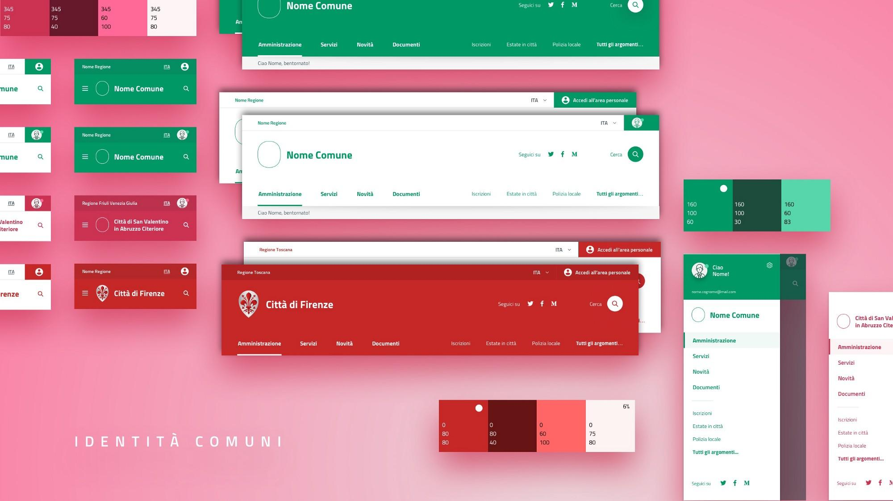
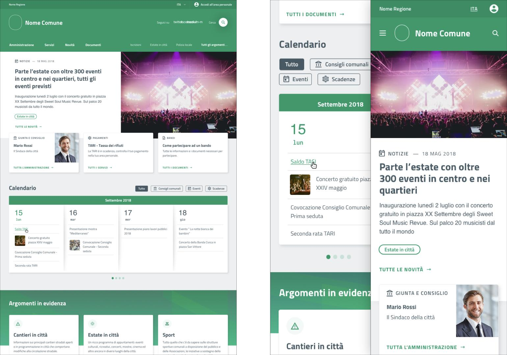
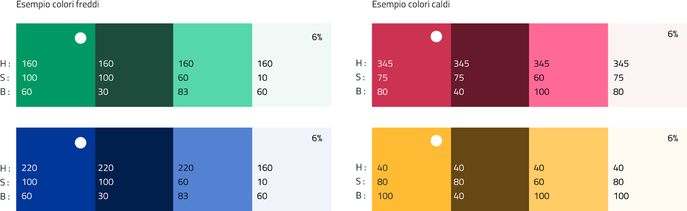
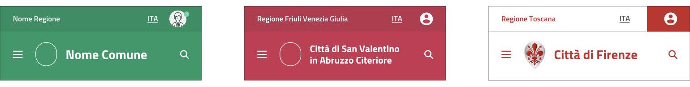
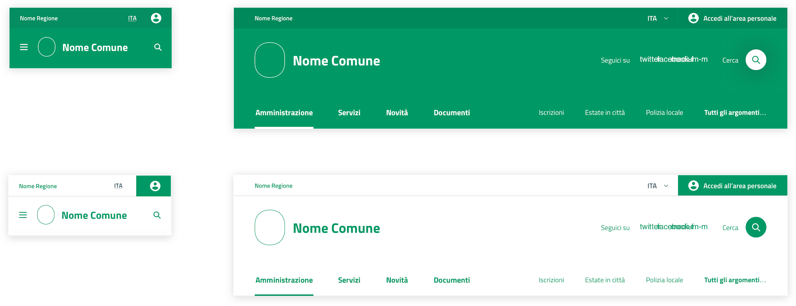
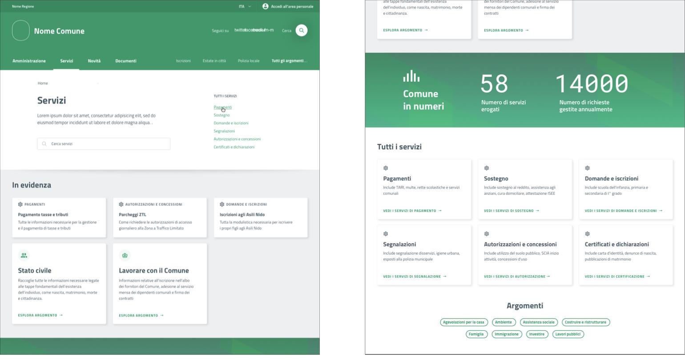

Prototipo hi-fi
===============

   L’identità dei comuni: esempi di componenti del sito
   personalizzati con loghi e colori istituzionali dei comuni.

Il prototipo hi-fi è stato costruito usando lo `UI kit di Designers
Italia <https://designers.italia.it/kit/ui-kit/>`__. A sua volta, il
progetto per i comuni ha contribuito ad arricchire lo UI kit della
Pubblica Amministrazione, secondo il modello collaborativo di Designers
Italia che permette a ciascun progetto di contribuire concretamente a un
sistema di design condiviso.

   Esempio di home page del sito di un comune, nella versione
   desktop (sinistra) e mobile (destra).

La progettazione delle pagine è *responsive*, *mobile-first* e a moduli,
a cominciare dalla *home page* (vedi :numref:`Figura %s <esempio-hp-img>`) 
che ricalca l’architettura delle informazioni del sito. I colori sono derivati dai
colori istituzionali del comune (vedi :numref:`Figura %s <palette-img>`).

   La palette di colori del sito è generata a partire dal colore  
   istituzionale del comune.

   La testata è il principale elemento di identità.

   La testata può essere positiva o negativa a seconda della
   complessità visiva e del colore di fondo del simbolo del comune.

I layout delle pagine sono pensati per permettere una scansione veloce
dei contenuti. Nella pagina dei servizi, ad esempio, quelli più
utilizzati hanno maggiore evidenza mentre gli altri sono accessibili a
partire da poche semplici categorie.

   Sezioni della pagina principale dei servizi che evidenziano
   quattro modalità d’accesso: ricerca, servizi più frequenti, categorie e
   argomenti.

Esplora il `prototipo hi-fi del sito dei
comuni <https://invis.io/Q2OTF1RMNUB>`__.
