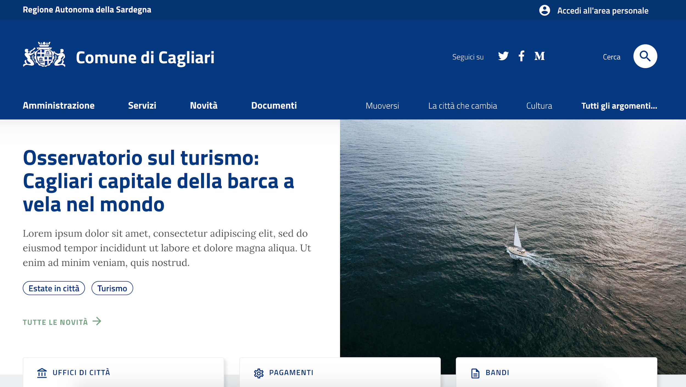

Progetto pilota con il Comune di Cagliari
=========================================

Il Comune di Cagliari, che segue l’evoluzione di Designers Italia
dalla nascita, ha deciso di diventare *early adopter* e utilizzare il
prototipo per la nuova versione del proprio sito web.

   Prototipo in alta definizione del nuovo sito istituzionale
   del Comune di Cagliari (in fase di realizzazione). 

Strategia digitale del Comune di Cagliari
-----------------------------------------

L’amministrazione comunale ha da tempo intrapreso un percorso per un
radicale ripensamento della strategia di progettazione, gestione ed
erogazione dei servizi pubblici in rete. Trasparenza, comunicazione,
accountability, ascolto e confronto rappresentano condizioni abilitanti
per la creazione di valore pubblico. In questa strategia, le nuove
tecnologie dell’informazione e della comunicazione diventano uno
strumento fondamentale per modificare il rapporto tra la PA, i
cittadini, le imprese e tutti i portatori di interesse.

Strumenti e processo
--------------------

Il gruppo di Designers Italia e il team del Comune di Cagliari hanno
lavorato insieme nelle fasi cruciali del design del nuovo sito. La
collaborazione tra i due gruppi di lavoro ha permesso di validare le
ipotesi di progetto, migliorare la documentazione dei kit e approfondire
le aree più complesse dell’implementazione. Il contributo al progetto è
stato attuato su diversi fronti: User experience, User interface,
architettura dell’informazione, sviluppo dei template, test di usabilità
e creazione del primo progetto pilota in Italia.

Collaborazione
--------------

Tutti i risultati del progetto, a partire dai template html, verranno
rilasciati in modalità open source a disposizione di tutti i Comuni
italiani. Per questo è stato creato il repository pubblico di GitHub
dove verranno condivisi tutti gli elementi di UI/UX e di sviluppo. Tutta
la documentazione relativa al progetto verrà posizionata all’interno di
una sezione dedicata di `docs.italia.it <https://docs.italia.it>`_.

Il progetto
-----------

-  Sviluppo dei template grafici

-  Prototipo navigabile online, test di usabilità e survey

-  Workshop di co-design

-  User stories e scenarios

-  Riclassificazione e miglioramento dei contenuti

-  Durante la fase alpha verranno scelti scenari e user stories ad hoc
   per approfondire nei dettagli l’esperienza dell’utente.

-  Durante la fase beta, che co-esisterà con il sito attuale, verranno
   svolti numerosi test di usabilità per verificare le funzionalità del
   maggior numero di sezioni del nuovo sito.

Il rilascio finale del sito è previsto per maggio del 2019.

