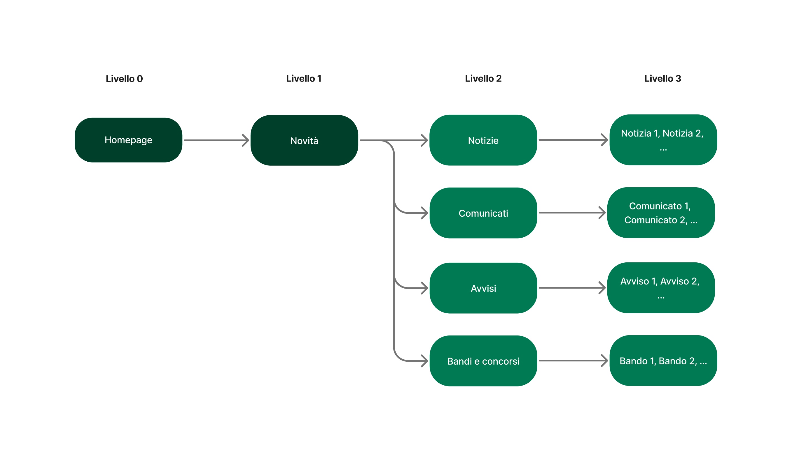

Sezione Novità
=================
La sezione Novità raccoglie le comunicazioni istituzionali del Comune verso il pubblico, come notizie e comunicati stampa, informazioni urgenti di servizio, opportunità di partecipazione a bandi e concorsi.

La sezione è accessibile dal menu di navigazione principale tramite la voce "Novità".

La sezione è organizzata su tre livelli:

- Primo livello: la pagina lista "Novità", che offre una panoramica generale di tutti i contenuti pubblicati dal Comune e permette all'utente di orientarsi verso la categoria di interesse.
- Secondo livello: quattro pagine lista, una per ciascuna tipologia di contenuto (Notizie, Comunicati, Avvisi, Bandi e concorsi). Ogni pagina raccoglie tutti i contenuti di quella categoria, con strumenti di ricerca e filtro per facilitare la consultazione.
- Terzo livello: le pagine di dettaglio dei singoli contenuti, dove è presente tutta l'informazione relativa a una notizia, un comunicato, un avviso o un bando specifico.

Pagina di primo livello "Novità"
----------------------------------

La pagina di primo livello è il punto di ingresso alla sezione. Presenta una sezione "In evidenza" dove presentare i contenuti più importanti e rilevanti, la lista dei contenuti più recenti con un campo di ricerca testuale e la navigazione alle pagine di secondo livello Notizie, Comunicati, Avvisi, Bandi e Concorsi.

.. admonition:: Interfaccia e sviluppo

   - Layout hi-fi: PAGE LAYOUTS > Notizie nel file figma del modello.
   - Template HTML: 

Pagine lista di secondo livello
-------------------------------------
Le pagine lista di secondo livello presentano l'elenco dei contenuti già filtrato per ciascuna categoria. Il template prevede una sezione in evidenza per i contenuti prioritari, un campo di ricerca testuale, filtri per argomento e un sistema di paginazione dei risultati.

.. admonition:: Interfaccia e sviluppo

   - Layout hi-fi: PAGE LAYOUTS > Notizie nel file figma del modello.
   - Template HTML: 

Notizie
----------
La notizia è un contenuto informativo di carattere editoriale che racconta attività, eventi, iniziative o aggiornamenti dell'amministrazione comunale. Ha un taglio descrittivo e divulgativo, pensato per informare i cittadini in modo accessibile e narrativo. Può includere contesto, immagini e approfondimenti.
La pagina foglia "Notizia" presenta il contenuto completo della notizia, l'immagine di copertina, i riferimenti all'ufficio o alla persona responsabile e i temi associati.

.. admonition:: Architettura e contenuti

   Tipologia di contenuto: **Notizia**.

.. admonition:: Interfaccia e sviluppo

   - Layout hi-fi: PAGE LAYOUTS > Notizie nel file figma del modello.
   - Template HTML: 

Comunicati
-------------
Il comunicato stampa è un contenuto ufficiale emesso dall'amministrazione comunale con l'obiettivo di informare i media e il pubblico su decisioni, posizioni istituzionali o fatti rilevanti. Ha un linguaggio formale e strutturato, spesso pronto per la pubblicazione giornalistica, e segue uno stile sintetico e dichiarativo.

.. admonition:: Architettura e contenuti

   Tipologia di contenuto: **Notizia**.

.. admonition:: Interfaccia e sviluppo

   - Layout hi-fi: PAGE LAYOUTS > Notizie nel file figma del modello.
   - Template HTML: 

Avvisi
-----------
L'avviso è un contenuto di servizio che comunica informazioni pratiche e operative di interesse immediato per i cittadini, come scadenze, interruzioni di servizi, modifiche alla viabilità. È essenziale, diretto e orientato all'azione: indica cosa cambia e cosa devono fare le persone.

.. admonition:: Architettura e contenuti

   Tipologia di contenuto: **Notizia**.

.. admonition:: Interfaccia e sviluppo

   - Layout hi-fi: PAGE LAYOUTS > Notizie nel file figma del modello.
   - Template HTML: 

Bandi e concorsi
-----------------
Il bando è un contenuto che descrive una procedura pubblica promossa dal Comune per selezionare soggetti, assegnare contributi o affidare servizi. Include informazioni su destinatari, requisiti, modalità di partecipazione, scadenze e documentazione necessaria. Può riguardare gare d'appalto, concorsi pubblici, contributi a cittadini o imprese e concessioni.

.. admonition:: Architettura e contenuti

   Tipologia di contenuto: **Bando o concorso**.

.. admonition:: Interfaccia e sviluppo

   - Layout hi-fi: PAGE LAYOUTS > Notizie nel file figma del modello.
   - Template HTML: 

